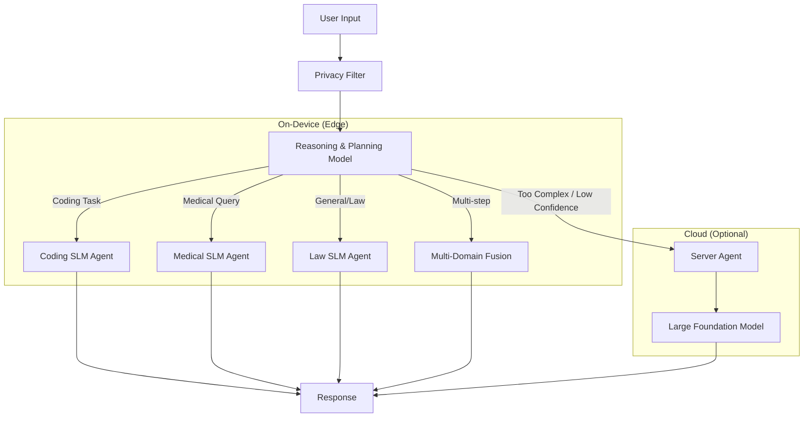

# On-Device Agentic AI: Privacy-Preserving Reasoning & Planning System

**Status:** Active Development  
**Institution:** United International University (UIU)  
**Department:** Computer Science and Engineering

---

## 📖 Overview

**On-Device Agentic AI** (formerly *PrivAdapt*) is a privacy-first framework that brings agentic reasoning to edge devices. Instead of relying on a single monolithic model, this system uses a lightweight **Reasoning/Planning Model** as a "Router."

This Planner analyzes user queries and dynamically routes them to the most appropriate execution agent:
1.  **Local Expert Agents:** Specialized Small Language Models (SLMs) running entirely offline (e.g., Coding, Medical, Law).
2.  **Multi-Domain/Fused Agents:** For tasks requiring overlapping expertise.
3.  **Server Agent:** A secure fallback to a large cloud LLM for highly complex or ambiguous queries.

This architecture ensures that **personal data stays on-device** for the majority of tasks, utilizing the cloud only when absolutely necessary and with strict privacy guardrails.

---

## 🏗️ Architecture

The system follows a **Planner-Worker** pattern:

## Repository Structure

    OnDevice-Agentic-AI/
    ├── assets/                  # Diagrams and images (e.g., architecture flows)
    ├── data/
    │   ├── episodic_memory/     # Local database for storing past successful plans
    │   └── user_profiles/       # Privacy-preserving user preferences
    ├── src/
    │   ├── agents/              # The "Workers"
    │   │   ├── __init__.py
    │   │   ├── base_agent.py    # Abstract base class for all agents
    │   │   ├── local_medical.py # Specialized SLM (e.g., Med-TinyLlama)
    │   │   ├── local_coding.py  # Specialized SLM (e.g., Phi-3-Mini)
    │   │   ├── local_law.py     # Specialized SLM
    │   │   └── server_agent.py  # Secure bridge to Cloud LLM (e.g., GPT-4/Gemini)
    │   ├── planner/             # The "Brain"
    │   │   ├── __init__.py
    │   │   ├── reasoning_model.py # The lightweight routing model
    │   │   └── task_decomposer.py # Breaks complex queries into sub-tasks
    │   ├── core/
    │   │   ├── orchestration.py # Manages the flow: Input -> Planner -> Agents -> Output
    │   │   └── privacy.py       # PII scrubbing before server offloading
    │   └── utils/
    │       ├── config.py
    │       └── logger.py
    ├── tests/                   # Unit tests for agents and planner
    ├── notebooks/               # Jupyter notebooks for testing individual SLMs
    ├── requirements.txt         # Dependencies (pytorch, transformers, langchain, etc.)
    ├── main.py                  # Entry point to run the CLI or API
    └── README.md                # The file generated below

### Key Components
* The Planner (Reasoning Model): A highly efficient SLM (e.g., Phi-3, Orca-2) fine-tuned to decompose tasks and select tools. It does not generate the final answer but decides who should answer.

* Local Expert Agents: Specialized SLMs optimized for specific domains. They are smaller, faster, and run without internet.

* Episodic Memory: The system learns from past interactions, storing successful plans locally to speed up future similar requests.

### 🚀 Key Features
* 🔋 Offline-First: Core functionality (Coding, Medical, General chat) works without internet access.

* 🛡️ Privacy by Design: Raw data never leaves the device unless the Planner explicitly flags a task as "Cloud Required" AND the user grants permission.

* 🧠 Agentic Reasoning: Capable of breaking down multi-step problems (e.g., "Analyze this medical report and write a Python script to graph the data" -> Medical Agent + Coding Agent).

* ⚡ Low Latency: Routing to specialized SLMs is often faster than querying a massive generalist cloud model.

## 👥 Authors & Contributors
This project is developed as part of the Bachelor of Science in Computer Science and Engineering at United International University.

    Redwanul Islam Nayeem (011221523)
    
    Md Saib Hossain (011221450)
    
    Md Shakil Hossain (0112230670)
    
    Samiul Haque Rudra (011221023)
    
    Mst. Sumia Khatun (011221563)
    
    Asma Sadia Tarisha (011213129)